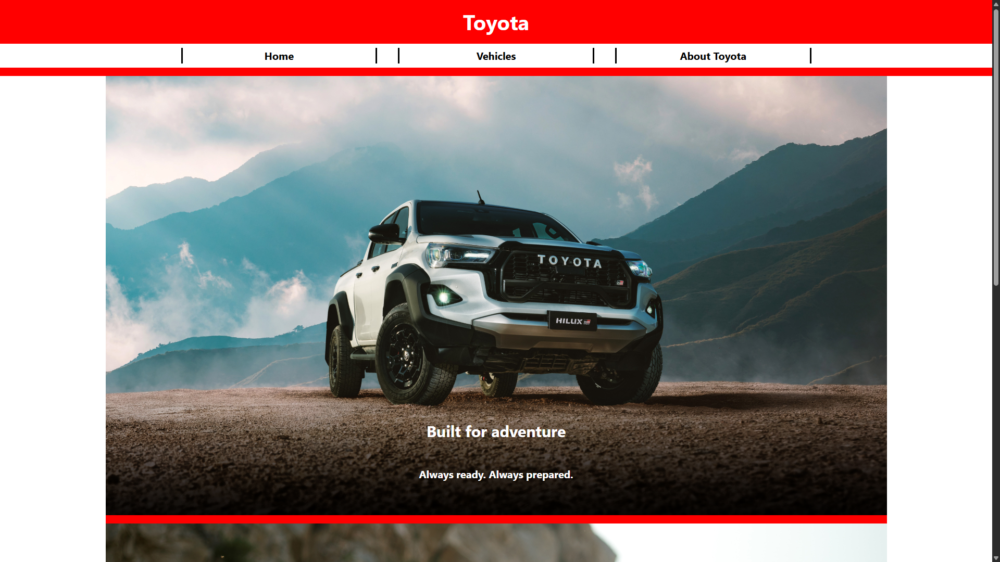

# Toyota Website Fan Project

Personal website project for applying web development concepts.
Done using raw HTML, CSS and NodeJS backend.
Server configured with Nginx and deployed on a raspberry pi.



Run with docker:

```bash
docker build -t "car-site" .
docker run -d --env-file .env -p 3000:3000 --name "car-site" car-site
```

For deployment, make sure you have:

- `.env` file with your PORT variable
- A TLS certificate
- A domain address

```bash
cp deploy/nginx/car-site.conf /etc/nginx/sites-available/
ln /etc/nginx/sites-available/car-site.conf /etc/nginx/sites-enabled/

sudo nginx -t
sudo systemctl reload nginx
```
